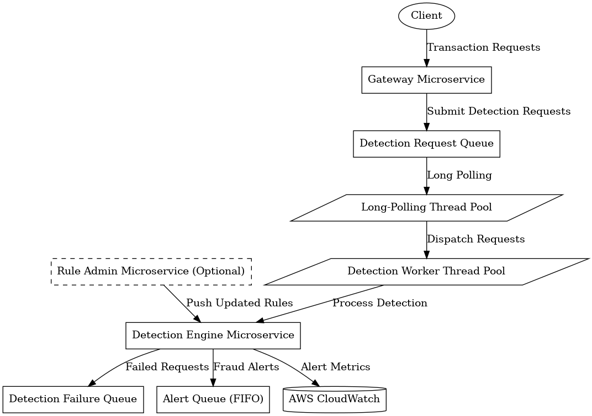

# High-level Design

## Java Stack

   - Java 17
   - Springboot (framework)
   - Maven (build and dependency management)
   - JUnit (test)
   - Jakarta Validation
   - Springdoc (Swagger/OpenAPI)
   - Slf4j over Logback (logging)
   - Google Guava (utilities)
   - Apache Commons (lang3, io, codec)
   - Lombok (java bean processing)
   - AWS SDK v2
   - Testcontainers (test)
   - LocalStack (emulates AWS)
   - K0S (Kubernetives on local box)
   - Jacoco (test coverage)
   - Spotless (code formatting)

## Components

   Architecture diagram is as follows (generated by Grahvz, running [./draw_diagram.py](./draw_diagram.py):

   

     
   

1. **3 AWS SQS Queues**: 
   1. `detection request queue` - a standard SQS queue for ingesting incoming transaction detection requests.
   2. `detection failure queue` - a standard SQS queue for failed detection requests.
   3. `alert queue` - a FIFO SQS queue for detected fraud alerts.

2. **Fraud Detection Microservice**:
   - Ideally, we have 3 microservices for this application:

     1. `gateway` microservice: exposes a RESTful interface (or gRPC) to clients to accept transaction detection requests, forwarding all requests to the `detection request queue`.

     2. `detection engine` microservice: asynchronously ingests detection requests from the `detection request queue`; performs rule-based fraud detection. For each detected fraudulent transaction:
       - sends an alert message to the `alert queue`
       - sends an alert metrics counter to specific CloudWatch Metrics
       - if an error occurs during detection processing, sends the error message to the `detection failure queue`

     3. `rule admin` microservice: manages all rules and pushes rule changes to the `detection engine` microservice.

   For a real-world application, `rule admin` is essential for centralized rule management. Currently, to simplify the demo, all rules are hardcoded into the `detection engine` microservice, so #3 is not implemented yet. Similarly, `gateway` is merged into the `detection engine` microservice.

3. **Logging**:

   The Java processes do not need to be aware of the underlying distributed logging mechanism. They output logs to the console and regular logging files. Logs are collected by the CloudWatch Agent, deployed to the Kubernetes cluster as a daemonset. Each cluster node has a CloudWatch Agent daemon responsible for collecting logs, making it transparent for Java processes and decoupling CloudWatch logs from Java processes.

## Key Design Choices

1. The detection process is divided into 2 separate microservices, although they are merged in this demo.

   To handle high-throughput requests, we queue incoming requests. The request submit API endpoint's only task is to forward the request to the queue, which is IO-intensive, not CPU-intensive.

   In contrast, rule-based fraud detection is CPU-intensive, not IO-intensive. These two processing aspects have different characteristics, affecting scaling and resource costs. Therefore, they are divided into 2 separate microservices to maximize resource utilization flexibility.

2. For an asynchronous queue-based system, we leverage 2 dedicated thread pools to ensure real-time processing.

   How do they work? First, a fixed-size thread pool is used for long-polling on the SQS detection request queue. Its size is configurable but defaults to 1. Second, a fixed-size worker thread pool runs the fraud detection engine. Each thread in this pool consumes a detection request and performs rule-based detection. The long-polling thread picks a request from the queue and quickly dispatches it to the detection worker thread, following a non-blocking approach. The polling thread does not care about the detection result; it marks the request as completed and tells the SQS queue to delete the request message immediately. This approach ensures quick consumption of detection requests, preventing message accumulation. Failures are handled in the detection worker thread, which sends failure message to the `detection failure queue`.

   The long-polling thread size of 1 works well because it is IO-intensive. The detection worker thread pool size is configured to the number of CPU cores, as rule evaluation is CPU-intensive. Having many worker threads would incur high thread context switching costs, resulting in low performance or high latency, so a large detection worker thread pool doesn't make sense. Thus, to increase detection process throughput, prefer to scale the service instances than increase the size of detection worker thread pool.

   Similarly, when a fraudulent transaction is found, alert sending happens asynchronously to avoid interfering with detection worker threads.

   For details:
   - Long-polling thread: see `src/main/java/qiangyt/fraud_detection/app/controller/DetectionSqsController.java`
   - Detection worker thread and asynchronous alerting: see `src/main/java/qiangyt/fraud_detection/app/service/DetectionService.java`

3. Why is the `alert queue` a SQS FIFO queue while the other 2 queues are not?

   The `detection request queue` requires high throughput and low latency. FIFO is unnecessary as detection does not care about message order. For the `alert queue`, we leverage the SQS FIFO queue's `messageDeduplicationId` feature to ensure alert uniqueness. Each unique transaction detection request produces at most one alert.

   Below is how `messageDeduplicationId` is used:

   - When a detection request is accepted, a UUID (`request id`) is generated and bound to the request, then forwarded to the `detection request queue`.

   - Since the `detection request queue` is not an SQS FIFO queue, it delivers messages at least once, possibly causing several service instances to receive the same request and perform duplicate detection. Occasional repetitive detection processing is acceptable as long as no duplicate alerts are generated.

   - When a fraudulent transaction is detected, the unique `request id` is used as the `messageDeduplicationId` of alert messages. The SQS FIFO queue ensures alert message uniqueness by checking the `messageDeduplicationId`. For details, see `src/main/java/qiangyt/fraud_detection/app/alert/SqsAlerter.java`.

   - FIFO queue performance: assuming fraudulent transactions are infrequent, the lower performance of the SQS FIFO queue is acceptable.

4. Chain of Rule-based Detection Engine:

   A simple rule detection interface is designed as the entry point of the detection engine. See `src/main/java/qiangyt/fraud_detection/app/engine/DetectionEngine.java`. Currently, only 2 hardcoded rules are implemented: `src/main/java/qiangyt/fraud_detection/app/engine/rules` and `src/main/java/qiangyt/fraud_detection/app/engine/rules/SuspiciousAccountRule.java`. For more flexible, externally-editable rule implementation, a Drools-based implementation is reserved (but not yet implemented), see `src/main/java/qiangyt/fraud_detection/app/engine/DroolsRuleEngine.java`.

   In the detection chain, whenever a fraudulent transaction is found by a chain node, processing stops, and an alert is sent.

   This design allows easy extension of rules in different ways. For most cases, a Drools-based implementation works well, but sometimes, a hardcoded implementation fits cases requiring extreme performance.

5. Group of Alerters with Unified Alerter Interface:

   See package `src/main/java/qiangyt/fraud_detection/app/alert`. There are 3 implementations for the alerter interface:

   1. `CloudWatchMetricAlerter`: sends alert metrics (a counter) to CloudWatch Metrics for easy alert statistics using the CloudWatch Metrics console.

   2. `SqsAlerter`: sends alerts to a SQS queue, allowing other services to consume the alerts for further processing.

   3. `GroupedAlerter`: groups the `CloudWatchMetricAlerter` and `SqsAlerter` so that an alert is sent to both the SQS queue and CloudWatch Metrics.

### Other Design Considerations

Several design considerations are necessary for a basic real-world fraud detection application but are not included here due to time limitations.

1. Security:

   - An HTTPS ingress is essential if external clients need to access this application
   - Even for in-cluster clients, HTTPS is needed because this service is highly sensitive and should be carefully protected.
   - Authentication should be implemented, for ex., JWT-based approach

2. Request duplication check is needed to ensure clients do not send requests repeatedly (e.g., due to network jitter and consequent retries). Mechanisms like Bloom filters can achieve this.

3. `rule admin` microservice is needed always and also needs an administrative UI to manage the rules including a dashboard.

4. Distributed tracing is essential for a system composed of many microservices