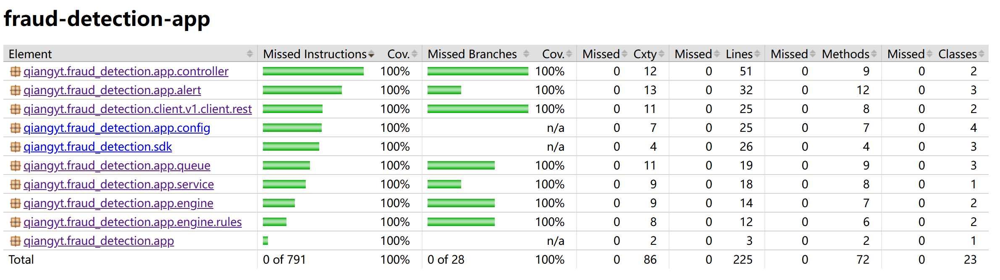

# Unit Tests and Integration Tests for fraud-detection-app

   - Regarding the configuration of detection rule values:
  
      For simplicity, the relevant configuration values are hard-coded in `src/main/java/qiangyt/fraud_detection/app/config/RuleProps.java`, including:

      - Maximum transaction amount: 100000

      - Suspicious accounts: `cgrant` and `fbiden`.

      As shown below:

      ```java
      /** Maximum transaction amount allowed before flagging as suspicious. */
      int maxTransactionAmount = 100000;

      /** Set of suspicious account usernames. */
      Set<String> suspiciousAccounts = Set.of("cgrant", "fbiden");
      ```

      Modifications require a rebuild to take effect.

   - When executing the build script [./script/build.sh](./script/build.sh), it will run all unit tests and integration tests, and generate a test coverage report, usually taking about 30 seconds.

     - Build artifacts:

       - Test execution report: [./target/reports/surefire.html](./target/reports/surefire.html)

       - Code coverage report: 
         [./target/jacoco-report/index.html](./target/jacoco-report/index.html)

         We achieved 100% both line coverage and branch coverage!
         <p align="left">
         
         </p>

   - Integration test case description:

     See [../src/integration-test/java/qiangyt/fraud_detection/SubmitIT.java](../src/integration-test/java/qiangyt/fraud_detection/SubmitIT.java).

     This case performs the following steps:

     1. First, clear both the SQS detection request queue and SQS alert queue to ensure no interference from previous tests. Note: please ensure no other tests are running at this time.

     2. Submit a detection request for a normal transaction, then long poll the SQS alert queue to verify no alerts are generated.

     3. Submit another detection request for a transaction, but this time submit a simulated large transaction, then long poll the SQS alert queue to verify an alert is received.

     4. Finally, clear both the SQS detection request queue and SQS alert queue again to minimize the impact on the test environment.


## Running the System and Verifying Core Logic

### Running Locally

   Execute [./script/run.sh](./script/run.sh). This script will use the local Java environment to run [./target/fraud-detection-app-*-SNAPSHOT.jar](./target/fraud-detection-app-0.0.1-SNAPSHOT.jar)

### Running on AWS K8S

   The app runs when deployed to K8S.

   Please replace all instances of `localhost` in the following sections to test it.

   The service logs transactions and alerts to AWS CloudWatch. We can view the logs using the following command:

   ```bash
   aws logs get-log-events --log-group-name "<log-group-name>" --log-stream-name "<log-stream-name>"
   ```

   To delete the deployed Kubernetes resources:

   ```bash
   kubectl delete -f k8s/
   ```

   Ensure to also delete all AWS-related resources (such as ECR repositories, SQS queues, and CloudWatch logs and metrics).

### Verifying Core Logic

   Open an AWS Cloud Shell or (EC2) Terminal, and first set the service URL:

   ```bash
   export SERVICE_URL=http://localhost:8080  # Adjust according to the running environment
   ```

   Then execute the following curl commands to verify if it works correctly

   1. Asynchronously submit a detection request, simulating a fraudulent transaction

      ```bash
      curl --request POST \
           --url $SERVICE_URL/rest/detection \
           --header 'content-type: application/json' \
           --data '{"accountId": "integration-test-account-1","amount": 99900000,"memo": "N/A"}'
      ```

      This API is used to submit a detection request. The detection request will enter SQS on the server side and asynchronously trigger the actual detection action. Therefore, the current return result only needs to be HTTP 200 status to indicate that the detection request was successfully submitted. The result is as follows:

      ```bash
      {"accountId":"integration-test-account-1","amount":99900000,"memo":"N/A","id":"SIC9u659TKCsQxeAzTml-g","receivedAt":1733891474356}
      ```

      Observe the server logs, and you will soon see:

      ```bash
      fraud detected: {"id":"HNFPS3pJTSCljIBNU-KDfQ","entity":{"accountId":"integration-test-account-1","amount":99900000,"memo":"N/A","id":"SIC9u659TKCsQxeAzTml-g","receivedAt":1733891474356},"fraudulent":true,"category":"BIG_AMOUNT","message":"the transaction amount exceeds a threshold","detectedAt":1733891475134}
      ```

      This indicates that an abnormal transaction was detected (transaction amount 99900000 exceeds 100000).

      If deployed to EKS, alerts will be observed in 3 places:
         - CloudWatch Log
         - CloudWatch Metric
         - SQS Alert Queue

   2. Synchronously submit a detection request:

      ```bash
      curl --request GET \
           --url $SERVICE_URL/rest/detection \
           --header 'content-type: application/json' \
           --data '{"id": "integration-test-2","accountId": "fbiden","amount": 999,"memo": "N/A"}'
      ```

      This API is designed for convenient test verification. It directly returns the detection result instead of triggering an alert. The return result is as follows:

      ```bash
      {"id":"I4XyQT5GSh2tjbp4Ocf_dQ","entity":{"accountId":"fbiden","amount":999,"memo":"N/A","id":"integration-test-2","receivedAt":null},"fraudulent":true,"category":"SUSPICIOUS_ACCOUNT","message":"the transaction originates from a suspicious account","detectedAt":1733891805866}
      ```

### Futher Test Improvements

  - [localstack](https://localstack.cloud/), a fully functional local AWS cloud stack to develop offline

  - [Testcontainers](https://testcontainers.com/), integration tests and unit tests with real 3rd-party dependencies (including supports the `localstack`)

  - [K0S](https://docs.k0sproject.io/stable/), all-inclusive Kubernetes distribution for local K8S testing
